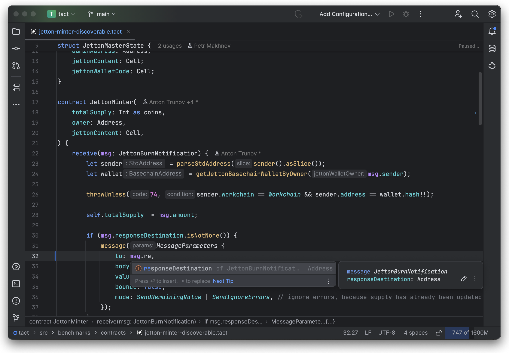

# Tact language plugin for JetBrains IDEs

Developed by [TON Studio](https://tonstudio.io), powered by the community.

**[Features] • [Installation] • [Community]**

[Features]: #features

[Installation]: #installation--usage

[Community]: #community

---

This plugin provides support for the [Tact programming language](https://tact-lang.org) to JetBrains IDEs.
Tact is a next-generation programming language for building secure, scalable, and maintainable smart contracts on TON
blockchain.

## Features

- Semantic syntax highlighting
- Code completion, snippets, imports completion
- Go to definition, implementation, type definition
- Find all references, workspace symbol search, symbol renaming
- Types and documentation on hover
- Inlay hints for types, parameter names, and more
- Lenses with usages count and VCS author
- On-the-fly inspections with quick fixes
- Signature help inside calls and `initOf`
- Build single contract or projects from `tact.config.json` via Run configuration
- Formatting with shortcut and on save

## Installation & Usage

> [!WARNING]
> The current plugin conflicts with the TON plugin before version 2.5.5, as both add Tact support,
> please update the TON plugin to version 2.5.5 or newer.

- Using an IDE built-in plugin system:

  <kbd>Settings/Preferences</kbd> > <kbd>Plugins</kbd> > <kbd>Marketplace</kbd> > <kbd>Search for "Tact"</kbd> >
  <kbd>Install Plugin</kbd>

- Manually:

  Download the [latest release](https://github.com/tact-lang/intelli-tact/releases/latest) and install it manually using
  <kbd>Settings/Preferences</kbd> > <kbd>Plugins</kbd> > <kbd>⚙️</kbd> > <kbd>Install plugin from disk...</kbd>

## Community

- [`@tactlang` on Telegram](https://t.me/tactlang) — Main community chat and discussion group.
- [`@tactlang_ru` on Telegram](https://t.me/tactlang_ru) _(Russian)_
- [`@tact_kitchen` on Telegram](https://t.me/tact_kitchen) — Channel with updates from the team.
- [`@tact_language` on X/Twitter](https://x.com/tact_language)
- [`tact-lang` organization on GitHub](https://github.com/tact-lang)
- [`@ton_studio` on Telegram](https://t.me/ton_studio)
- [`@thetonstudio` on X/Twitter](https://x.com/thetonstudio)

## License

This project is under the **MIT License**. See the
[LICENSE](https://github.com/tact-lang/intelli-tact/blob/master/LICENSE)
file for the full license text.
